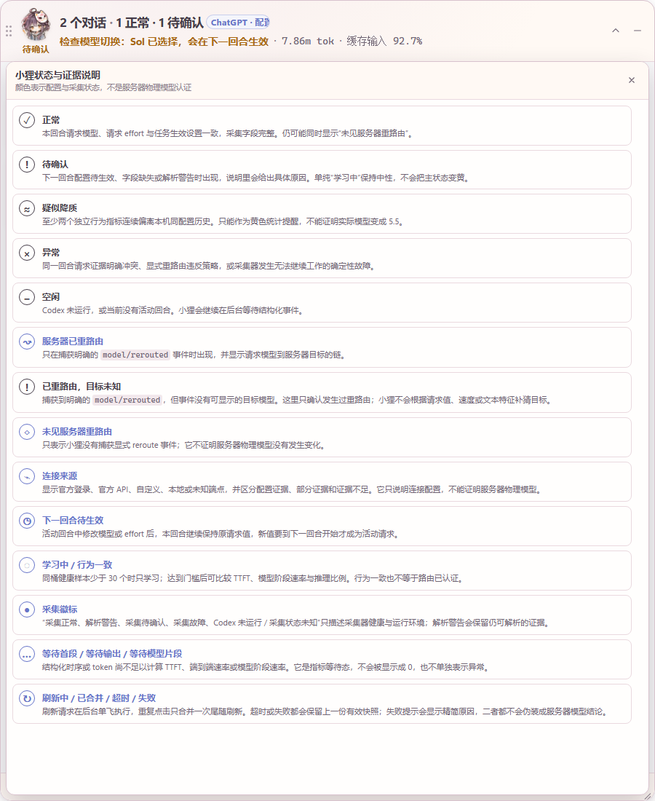

# 小狸 · XiaoLi

<p align="center">
  
</p>

<p align="center">一个小巧、可拖动、可缩放的 Codex 模型、Token、缓存与时序旁路监视器。</p>

> 当前版本：`v0.1.0-beta.2`。这是独立社区项目，与 OpenAI 没有隶属关系，也不代表 OpenAI 官方背书。

[English](README.en.md) · [下载便携版](https://github.com/XuYing1128/XiaoLi/releases) · [状态与证据详解](docs/STATUS_AND_EVIDENCE.md) · [故障排查](docs/TROUBLESHOOTING.md)

## 小狸解决什么问题

Codex 界面显示的是你选择的模型和思考档位，但开发者还会关心：本回合到底请求了什么、切换是否已生效、是否收到服务器重路由通知、消耗了多少 Token、缓存输入占比多少、响应是否明显偏离本机历史。

小狸只读结构化 rollout、官方插件 hook 和本地派生缓存，把这些证据分开显示：

- `Sol · ultra（请求）`：本回合实际发起时的请求配置。
- `下一回合 Sol（待生效）`：活动回合中修改后的设置，不会冒充本回合值。
- `Sol → 5.5（服务器已重路由）`：只来自明确的 `model/rerouted` 事件。
- `未见服务器重路由`：没有捕获明确 reroute；不等于物理模型已经被认证。
- Token、缓存输入占比、上下文占比、推理输出、活动耗时、TTFT 区间和两种观测速率。
- 保守的黄色“疑似降质”：只和本机同配置历史比较，不会伪造服务器模型结论。

小狸不会代理 Codex 网络、拦截请求、修改会话正文或注入 Codex 外壳。

## 状态展示说明

颜色不是唯一提示。窗口、托盘和键盘可访问文本会同时显示图形与说明。

| 图形与状态 | 颜色 | 什么时候出现 | 它真正表示什么 | 你该怎么做 |
| --- | --- | --- | --- | --- |
| `✓ 正常` | 绿 | 请求模型和请求 effort 与任务生效设置一致，采集字段完整 | 请求配置一致、采集健康；**不表示服务器物理模型已独立认证** | 通常无需处理；仍可查看路由徽标 |
| `! 待确认` | 黄 | 下一回合设置待生效、字段缺失或解析警告 | 请求或采集证据暂时不完整，具体原因会写在状态说明中 | 展开对应会话查看原因 |
| `≈ 疑似降质` | 黄 | 至少两个独立行为信号连续偏离本机同配置历史 | 统计行为异常；**不能据此断言实际变成 5.5 或 effort 被降低** | 点击展开查看观测值、中位数、MAD、样本量与限制 |
| `× 异常` | 红 | 同一回合 hook 与 rollout 明确冲突、显式重路由违反策略，或采集器确定性故障 | 已有明确冲突或采集无法继续 | 展开证据并按错误说明排查 |
| `– 空闲` | 灰 | Codex 未运行或没有活动回合 | 小狸正在静默等待 | 启动 Codex 或开始新回合 |
| `↝ 服务器已重路由` | 蓝紫徽标；冲突时红 | 捕获明确 `model/rerouted` | 这是小狸能够获得的最高等级服务器路由证据 | 查看完整路由链和事件时间 |
| `◇ 未见服务器重路由` | 灰徽标 | 没有捕获明确 reroute | 只表示“未观察到”，**不证明没有发生物理路由变化** | 结合请求证据使用，不要当作服务器认证 |
| `◷ 下一回合待生效` | 蓝 | 活动回合中切换模型或 effort | 本回合继续使用原请求值，新值从下一回合开始 | 开启下一回合后确认活动请求更新 |
| `◌ 学习中 X/30` | 中性 | 同桶完整健康样本少于 30 个 | 行为基线尚不足，不进行降质判断；它本身不会把主状态变黄 | 正常使用，等待样本积累 |
| `✓ 行为一致` | 中性/绿点 | 已有足够基线且当前指标未达到保守异常阈值 | 只表示相对本机历史一致，不是模型认证 | 无需处理 |
| `● 采集正常 / 警告 / 待确认 / 故障 / 未运行或未知` | 绿/黄/红/灰徽标 | 采集器健康、解析警告、字段不完整、确定性故障，或 Codex/采集状态尚不可用 | 只描述采集链路；解析警告不会抹掉仍可解析的证据 | 查看徽标 Tooltip 与具体原因 |
| `… 等待首段 / 等待输出 / 等待模型片段` | 中性 | 尚无足够的结构化 item 或输出 Token 计算对应指标 | 是指标等待态，不会用 `0` 冒充，也不单独表示异常 | 等待本回合继续产生结构化事件 |
| `⟳ 刷新中 / 已合并 / 超时 / 失败` | 中性/黄色提示 | 手动刷新在后台扫描、与已有刷新合并、15 秒内未返回，或后台命令明确失败 | 这是交互状态，不是服务器模型结论；超时或失败均保留上一份有效快照，失败会显示精简原因 | 可继续操作；按原因排查后重试刷新 |

下面是使用合成数据生成的应用内状态说明页；不含真实任务、用户路径或会话 ID：



应用内也有相同说明：展开小狸，打开 `…`，选择“状态与证据说明”。

## 便携版快速开始

### Windows 10/11 x64

1. 从 [Releases](https://github.com/XuYing1128/XiaoLi/releases) 下载 `XiaoLi-v0.1.0-beta.2-Windows-x64-portable.zip`。
2. 解压到一个长期保留的目录，例如 `D:\Apps\XiaoLi`。
3. 双击 `XiaoLi.exe`。首次启动会为当前用户写入或修复 Codex 插件路径，不需要管理员权限和 Node.js。
4. 在 Codex 中打开 `/hooks`，审阅并信任 `xiaoli-model-monitor` 的本地 hook。插件配置不会绕过 Codex 的 hook 信任确认。
5. 如果 Codex 在安装前已经运行，请新建任务或重启 Codex 后再开始回合。小狸会从托盘出现紧凑卡片。

未签名的新程序可能触发 Windows SmartScreen。请先核对 Release 的 SHA-256，再使用系统提供的“更多信息”流程确认运行；项目不会要求关闭 SmartScreen。

### macOS 12+，Intel 与 Apple Silicon

1. 下载并解压 `XiaoLi-v0.1.0-beta.2-macOS-universal.app.zip`。
2. 将 `XiaoLi.app` 移到“应用程序”，然后打开。
3. 首个 beta 采用 ad-hoc 签名、未公证。如果 Gatekeeper 阻止启动，请在“系统设置 → 隐私与安全性”中核对应用后选择“仍要打开”。项目不会提供关闭 Gatekeeper 的脚本。

### Linux x64

1. 下载 tar.gz，或下载包含 AppImage 的 ZIP。
2. 如果使用 ZIP，解压后只需赋予 AppImage 一次执行权限：

   ```bash
   chmod +x XiaoLi-x86_64.AppImage
   ./XiaoLi-x86_64.AppImage
   ```

Wayland 下置顶、托盘和绝对窗口位置取决于桌面合成器，属于 best effort；X11 支持更完整。

完整教程见 [快速开始](docs/GETTING_STARTED.md)。

## 窗口与操作

- 紧凑态默认 `304 × 72 DIP`，可缩放到 `280 × 68` 至 `520 × 120`。
- 展开态默认 `440 × 500 DIP`，可缩放到 `380 × 300` 至屏幕工作区 90% 内的 `760 × 800`。
- 头像、模型行、Token 行、标题空白和六点抓手都可拖动窗口。
- 根会话是折叠单位；展开后能看到所属子会话和子智能体。孤立子任务不会被静默丢弃。
- `—` 隐藏到托盘；菜单“退出小狸”才会真正释放窗口、托盘、watcher 和单实例资源。
- 可切换手绘二次元主题与极简主题。两种主题使用完全相同的证据层级。
- 实时更新采用稳定 DOM 节点，不会把列表拉回顶部或打断键盘焦点。

## 模型与思考程度的准确性边界

小狸能准确回答的是“这一回合请求了哪个模型和哪个 effort”，以及“是否捕获到明确服务器 reroute”。它不能从旁路日志独立证明数据中心最终使用的物理模型，也没有接口实测所谓“真实思考强度”。

- `activeRequest.model` 与 `activeRequest.effort` 是请求证据。
- effort 始终标记为“请求”。推理 Token 是实际用量，不是思考档位测量。
- 只有明确的 `model/rerouted` 能生成服务器路由链。
- 行为特征容易受网络、排队、工具调用、缓存、输入类型和系统负载影响，因此只允许生成黄色统计提醒。
- `TTFT 约 A–B` 来自首个结构化模型片段的开始与完成时间；任一端都不是精确首 Token。只有终态结构化报告才标记精确 TTFT。
- “端到端输出速率”包含排队、网络和工具等待；“模型阶段速率（估算）”只使用 Reasoning/AgentMessage 的结构化时间区间并集，两者都不是服务端纯生成 TPS。

更完整的证据等级、算法门槛和示例见 [状态与证据](docs/STATUS_AND_EVIDENCE.md)。

## 疑似降质为什么很保守

小狸按“请求模型 + 请求 effort + 未缓存输入量级 + 输出量级 + 是否使用工具”分桶。每桶至少需要 30 个完整、无解析警告、无显式 reroute 的健康回合。

只有 TTFT 偏高、模型阶段速率偏低、推理输出占比偏低、推理阶段时长占比偏低这四类单向信号参与投票。至少两个独立信号超过历史中位数 `4 × MAD`，并在相隔至少 2 秒且输出增加至少 64 Token 的两个检查点连续命中，才会显示“疑似降质”。恢复也需要两个健康检查点。缓存输入比例只用于解释，不参与投票。

即使本机有足够的 gpt-5.5 对照样本，小狸最多显示“行为统计上更接近本机 5.5 请求样本”，永远不会写成“实际模型是 5.5”。

## 插件与对话内工具

GUI 首次启动会在当前用户范围写入 `xiaoli-model-monitor` 配置。插件不需要 Node.js，所有入口都由同一个 Rust 可执行文件提供。首次安装、升级或移动程序后，仍须在 Codex `/hooks` 中审阅并信任新的 hook 命令；写入配置不等于 hook 已自动生效。

```text
xiaoli --hook-capture
xiaoli --mcp-server
xiaoli --install-plugin
xiaoli --uninstall-plugin
```

只读 MCP 工具：

- `get_monitor_summary()`：全部活动根会话的紧凑状态。
- `get_session_detail(threadId)`：指定根会话及子任务的完整证据。
- `render_monitor_card(threadId?, theme?)`：在 Codex 对话内返回监视卡数据。

MCP 当前状态只接受正在运行的小狸采集器通过 IPC 返回的数据，并标记 `snapshotSource: liveMonitorIpc`。小狸离线或 IPC 不可用时工具会明确报错，不会把磁盘旧快照冒充为实时模型。

插件 hook 只发送事件类型、线程/回合 ID、请求模型和时间戳；请求 effort 由结构化 `turn_context` 提供。小狸不保存 prompt、回复正文或完整 cwd。详见 [插件与 CLI](docs/CLI_AND_PLUGIN.md)。

## 本地数据与隐私

| 平台 | 默认状态目录 |
| --- | --- |
| Windows | `%LOCALAPPDATA%\XiaoLi` |
| macOS | `~/Library/Application Support/XiaoLi` |
| Linux | `$XDG_DATA_HOME/xiaoli`，未设置时为 `~/.local/share/xiaoli` |

SQLite 只保存派生游标、聚合、最近合格样本和行为基线；原始 rollout 始终是真源，数据库可以删除后重建。兼容日志不写消息正文、完整 cwd、原始重路由原因或私人路径。详见 [隐私说明](docs/PRIVACY.md)。

## CLI

```text
xiaoli --probe-once [--sessions-root PATH] [--session-index PATH] [--state-root PATH]
xiaoli --show
xiaoli --hidden
xiaoli --stop
xiaoli --hook-capture
xiaoli --mcp-server
xiaoli --install-plugin
xiaoli --uninstall-plugin
```

`--probe-once` 输出稳定的 `MonitorSnapshotV4` JSON，不写生产日志或解析缓存。完整字段见 [CLI 与快照参考](docs/CLI_AND_PLUGIN.md)。

## 开发与验证

```powershell
pnpm install --frozen-lockfile
pnpm run check
pnpm run build
cargo fmt --manifest-path .\src-tauri\Cargo.toml -- --check
cargo clippy --manifest-path .\src-tauri\Cargo.toml --all-targets --all-features -- -D warnings
cargo test --manifest-path .\src-tauri\Cargo.toml --locked
```

更多内容：

- [开发指南](docs/DEVELOPMENT.md)
- [贡献指南](CONTRIBUTING.md)
- [故障排查](docs/TROUBLESHOOTING.md)
- [变更记录](CHANGELOG.md)
- [设计系统](DESIGN.md)
- [角色素材来源与授权记录](ASSET_PROVENANCE.md)
- [第三方许可](THIRD_PARTY_NOTICES.md)

## 许可证

小狸以 [PolyForm Noncommercial 1.0.0](LICENSE) 提供，允许个人、学习、研究以及许可证列出的非商业组织用途，不授权商业用途。因为包含非商业限制，本项目应称为“源码公开 / source-available”，不是 OSI 定义下的开源软件。

角色与图标还受 [素材来源与分发声明](ASSET_PROVENANCE.md) 约束。第三方依赖继续遵循各自许可证。
